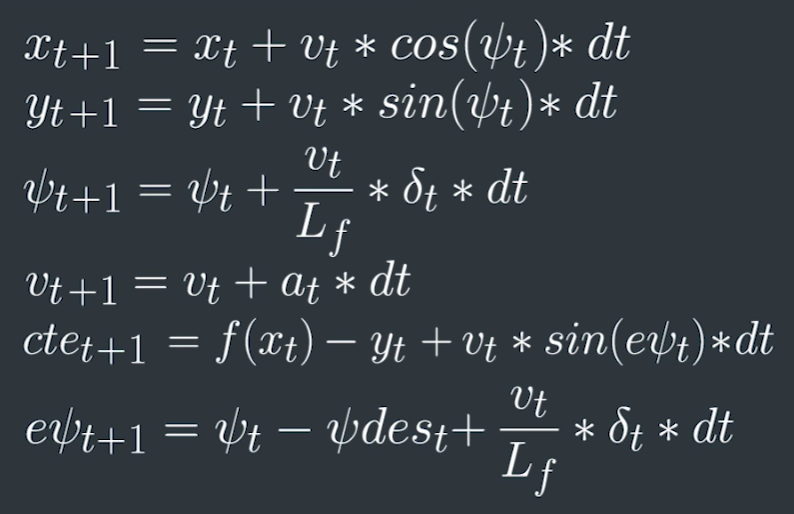

# CarND-Controls-MPC
Self-Driving Car Engineer Nanodegree Program

## Implementing Model Predictive Control (MPC)

### Define MPC Equations

By using an accurate model that describes the movements of vehicles we can implement a much better controller than a
PID controller. We will use the following equations for the MPC controller (© Udacity):



Here, the state of the vehicle is given by the position `(x,y)`, the current angle `psi` and the velocity `v`.
The actuators are the acceleration/deceleration `a` and the steering angle `delta`.

`cte` is the cross-track error and `epsi` is the difference of the reference angle to the current angle.

Each update takes the time delta `dt` into account - the higher `dt`, the larger the changes between updates will be.

### Choosing `N` and `dt`

For the MPC we define a set of parameters `N` and `dt`. `N` is the number of points we want to calculate, and
`dt` is the time difference between those. By calculating `N * dt`we can see how much time we can 'look into the future'.
E.g. by defining `N=30` and `dt=0.05` we will predict 1.5 seconds into the future.

In general, we want to choose smaller `N` and a higher `dt` so the prediction by IPOpt can be done in a reasonable amount
of time, while still providing the accuracy we need to steer the vehicle.

At first, I chose `N=30, dt=0.05`, which lead to longer time for calculation. Then I switched to `N=10, dt=0.1`, which
seemed to be a good trade-off and also matched the latency of 0.1 seconds which would be introduced later.

### Transforming the reference track and fitting a polynomial

The simulator gives us points of the reference track in absolute coordinates. I transformed these to be relative
to the location of the vehicle, which you can see [here](src/main.cpp#L77).

Then I fitted a 3rd order polynomial to these points, which you can see [here](src/main.cpp#L80).

### Choosing weights for the MPC cost function

In MPC.cpp I [defined a cost function](src/MPC.cpp#L58-L85) and added weights to the different part of the cost functions
using these rules:

- In general a high cross-track error or angle error should lead to a large cost.
- The speed is not as important as staying on the track, so it should be small.
- In general we want to steer and throttle as less as possible.
- The changes between steering angles of all timesteps should be as small as possible.
- The changes between throttling of all timesteps should be small, but not as important as steering angle.

### Run it!

After fixing some problems, mainly due to my model using different equations than the simulator, the car was
able to run around the track at a pretty high speed, as you can see in the video:


### Dealing with latency

Dealing with latency was straightforward. I just had to call the update equations again on the state given
by the simulator to predict the state the vehicle would have after the expected latency. You can [see my implementation
here](src/main.cpp#L69-L74).
For the expected latency I chose 0.12 seconds. This was to account for the added latency of 0.1 seconds as well as at
least 20 milliseconds for MPC computation.

### Learnings

- From the start I used test-driven development (TDD) to test certain functions and the basic
functionality of the `MPC` class. See [test/tests.cpp](test/tests.cpp) for details.
  - To achieve this I needed to add a C++ testing framework to the project first. As it turned out this was pretty
  straightforward. I will write a blog post about this for fellow Udacity students. 😃
- The implementation of the MPC as well as dealing with latency was straightforward.
- What took me a long time was figuring out why my code for latency didn't work as expected. Then I figured out that
I didn't convert the parameters given by the simulator to the expected ones of my MPC equations. My MPC equations expected
the steering angle to be positive when steering left, while the simulator expects the angle to ne negative for the same
direction. Because of this, I had to flip the sign twice: Once when getting the angle from the simulator and
once before sending it back.
Also, my MPC equations expected the speed to be in meters/second, while the simulator works with miles/hour. So I had to
convert this once, too.

Finally, after fixing the issues, the vehicle ran fast around the track - including the added latency! Enjoy:


---

## Dependencies

* cmake >= 3.5
 * All OSes: [click here for installation instructions](https://cmake.org/install/)
* make >= 4.1
  * Linux: make is installed by default on most Linux distros
  * Mac: [install Xcode command line tools to get make](https://developer.apple.com/xcode/features/)
  * Windows: [Click here for installation instructions](http://gnuwin32.sourceforge.net/packages/make.htm)
* gcc/g++ >= 5.4
  * Linux: gcc / g++ is installed by default on most Linux distros
  * Mac: same deal as make - [install Xcode command line tools]((https://developer.apple.com/xcode/features/)
  * Windows: recommend using [MinGW](http://www.mingw.org/)
* [uWebSockets](https://github.com/uWebSockets/uWebSockets)
  * Run either `install-mac.sh` or `install-ubuntu.sh`.
  * If you install from source, checkout to commit `e94b6e1`, i.e.
    ```
    git clone https://github.com/uWebSockets/uWebSockets 
    cd uWebSockets
    git checkout e94b6e1
    ```
    Some function signatures have changed in v0.14.x. See [this PR](https://github.com/udacity/CarND-MPC-Project/pull/3) for more details.
* Fortran Compiler
  * Mac: `brew install gcc` (might not be required)
  * Linux: `sudo apt-get install gfortran`. Additionall you have also have to install gcc and g++, `sudo apt-get install gcc g++`. Look in [this Dockerfile](https://github.com/udacity/CarND-MPC-Quizzes/blob/master/Dockerfile) for more info.
* [Ipopt](https://projects.coin-or.org/Ipopt)
  * Mac: `brew install ipopt`
       +  Some Mac users have experienced the following error:
       ```
       Listening to port 4567
       Connected!!!
       mpc(4561,0x7ffff1eed3c0) malloc: *** error for object 0x7f911e007600: incorrect checksum for freed object
       - object was probably modified after being freed.
       *** set a breakpoint in malloc_error_break to debug
       ```
       This error has been resolved by updrading ipopt with
       ```brew upgrade ipopt --with-openblas```
       per this [forum post](https://discussions.udacity.com/t/incorrect-checksum-for-freed-object/313433/19).
  * Linux
    * You will need a version of Ipopt 3.12.1 or higher. The version available through `apt-get` is 3.11.x. If you can get that version to work great but if not there's a script `install_ipopt.sh` that will install Ipopt. You just need to download the source from the Ipopt [releases page](https://www.coin-or.org/download/source/Ipopt/).
    * Then call `install_ipopt.sh` with the source directory as the first argument, ex: `sudo bash install_ipopt.sh Ipopt-3.12.1`. 
  * Windows: TODO. If you can use the Linux subsystem and follow the Linux instructions.
* [CppAD](https://www.coin-or.org/CppAD/)
  * Mac: `brew install cppad`
  * Linux `sudo apt-get install cppad` or equivalent.
  * Windows: TODO. If you can use the Linux subsystem and follow the Linux instructions.
* [Eigen](http://eigen.tuxfamily.org/index.php?title=Main_Page). This is already part of the repo so you shouldn't have to worry about it.
* Simulator. You can download these from the [releases tab](https://github.com/udacity/self-driving-car-sim/releases).
* Not a dependency but read the [DATA.md](./DATA.md) for a description of the data sent back from the simulator.


## Basic Build Instructions


1. Clone this repo.
2. Make a build directory: `mkdir build && cd build`
3. Compile: `cmake .. && make`
4. Run it: `./mpc`.

## Tips

1. It's recommended to test the MPC on basic examples to see if your implementation behaves as desired. One possible example
is the vehicle starting offset of a straight line (reference). If the MPC implementation is correct, after some number of timesteps
(not too many) it should find and track the reference line.
2. The `lake_track_waypoints.csv` file has the waypoints of the lake track. You could use this to fit polynomials and points and see of how well your model tracks curve. NOTE: This file might be not completely in sync with the simulator so your solution should NOT depend on it.
3. For visualization this C++ [matplotlib wrapper](https://github.com/lava/matplotlib-cpp) could be helpful.

## Editor Settings

We've purposefully kept editor configuration files out of this repo in order to
keep it as simple and environment agnostic as possible. However, we recommend
using the following settings:

* indent using spaces
* set tab width to 2 spaces (keeps the matrices in source code aligned)

## Code Style

Please (do your best to) stick to [Google's C++ style guide](https://google.github.io/styleguide/cppguide.html).

## Project Instructions and Rubric

Note: regardless of the changes you make, your project must be buildable using
cmake and make!

More information is only accessible by people who are already enrolled in Term 2
of CarND. If you are enrolled, see [the project page](https://classroom.udacity.com/nanodegrees/nd013/parts/40f38239-66b6-46ec-ae68-03afd8a601c8/modules/f1820894-8322-4bb3-81aa-b26b3c6dcbaf/lessons/b1ff3be0-c904-438e-aad3-2b5379f0e0c3/concepts/1a2255a0-e23c-44cf-8d41-39b8a3c8264a)
for instructions and the project rubric.

## Hints!

* You don't have to follow this directory structure, but if you do, your work
  will span all of the .cpp files here. Keep an eye out for TODOs.

## Call for IDE Profiles Pull Requests

Help your fellow students!

We decided to create Makefiles with cmake to keep this project as platform
agnostic as possible. Similarly, we omitted IDE profiles in order to we ensure
that students don't feel pressured to use one IDE or another.

However! I'd love to help people get up and running with their IDEs of choice.
If you've created a profile for an IDE that you think other students would
appreciate, we'd love to have you add the requisite profile files and
instructions to ide_profiles/. For example if you wanted to add a VS Code
profile, you'd add:

* /ide_profiles/vscode/.vscode
* /ide_profiles/vscode/README.md

The README should explain what the profile does, how to take advantage of it,
and how to install it.

Frankly, I've never been involved in a project with multiple IDE profiles
before. I believe the best way to handle this would be to keep them out of the
repo root to avoid clutter. My expectation is that most profiles will include
instructions to copy files to a new location to get picked up by the IDE, but
that's just a guess.

One last note here: regardless of the IDE used, every submitted project must
still be compilable with cmake and make./
